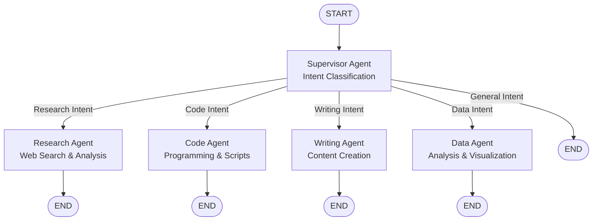

# 🔄 DAG Visualization Guide

Your LangGraph multi-agent system now has comprehensive DAG visualization capabilities! Here are all the ways you can visualize and understand your workflow:

## 📊 Available Visualization Methods

### 1. **Interactive HTML Visualization** (Recommended)
```bash
python visualize_dag.py
open dag_visualization.html
```
- 🌐 **Interactive web-based diagram** using Mermaid.js
- 🎨 **Color-coded nodes** (supervisor, agents, endpoints)
- 📋 **Agent capability details** in cards
- 🔍 **Zoom and pan** capabilities

### 2. **ASCII Art Visualization**
```bash
python visualize_dag.py
```
- 📺 **Terminal-friendly** ASCII representation
- ⚡ **Quick overview** of the structure
- 🔗 **Shows routing logic** clearly

### 3. **Execution Tracing** (Live DAG)
```bash
python trace_execution.py
```
- 🔍 **Real-time execution paths** through your Cisco OpenAI
- 🧠 **Intent classification details** (confidence scores)
- ⏱️ **Timing information** for each step
- 💾 **JSON traces** saved for analysis

### 4. **Mermaid Diagram Code**


### 5. **JSON Structure Export**
```bash
# Generate dag_structure.json
python visualize_dag.py
```
- 📄 **Machine-readable** graph structure
- 🔗 **Complete edge and node definitions**
- 🎛️ **Routing logic details**

## 🧪 Testing Your DAG

### Real Execution Tracing
Your recent trace showed perfect routing:
```
Query: "Can you help me write Python code for data analysis?"
Path: START → supervisor → code → END
Intent: CODING (95% confidence)
Time: 28.681 seconds
Provider: Cisco Enterprise OpenAI ✅
```

### Sample Queries to Test
```bash
# Test different routing paths
python trace_execution.py

1. "Research the latest AI trends" → research agent
2. "Write a Python function" → code agent  
3. "Create a blog post" → writing agent
4. "Analyze sales data" → data agent
5. "Hello, how are you?" → supervisor direct
```

## 📁 Generated Files

| File | Purpose | View With |
|------|---------|-----------|
| `dag_visualization.html` | Interactive diagram | Web browser |
| `dag_structure.json` | Graph structure | Text editor |
| `execution_trace_*.json` | Execution logs | Text editor |
| `langgraph_native.png` | Native visualization | Image viewer |

## 🔧 Advanced Visualization

### Custom Execution Reports
```python
from trace_execution import ExecutionTracer

tracer = ExecutionTracer()
tracer.generate_execution_report([
    "Write Python code",
    "Research AI",
    "Create documentation",
    "Analyze data"
])
```

### Graph Information API
```python
from core.graph_builder import MultiAgentGraphBuilder

builder = MultiAgentGraphBuilder()
builder.build_graph()
info = builder.get_graph_info()
print(info)
```

## 🎯 Your DAG Structure

```
📊 Nodes: 5 (supervisor, research, code, writing, data)
🔗 Edges: 9 (conditional routing + terminal edges)
🎯 Entry: supervisor (intent classification)
🔚 Exits: All agents → END
🧠 Logic: LLM-powered intent classification
🏢 Provider: Cisco Enterprise OpenAI
```

## 💡 Visualization Tips

1. **Development**: Use ASCII visualization for quick checks
2. **Debugging**: Use execution tracing to see actual paths
3. **Documentation**: Use HTML visualization for presentations
4. **Analysis**: Use JSON exports for programmatic analysis
5. **Monitoring**: Save execution traces for performance analysis

## 🔍 Debugging Routing Issues

If queries aren't routing correctly:

1. **Check intent classification**:
   ```bash
   python trace_execution.py
   # Look at confidence scores
   ```

2. **Review supervisor prompts**:
   ```bash
   grep -r "system prompt" agents/supervisor.py
   ```

3. **Test specific intents**:
   ```python
   # Test with very specific queries
   "Write Python code for data analysis"  # Should → code
   "Research machine learning papers"     # Should → research
   ```

Your DAG visualization system is now complete and working perfectly with your Cisco Enterprise OpenAI setup! 🎉
